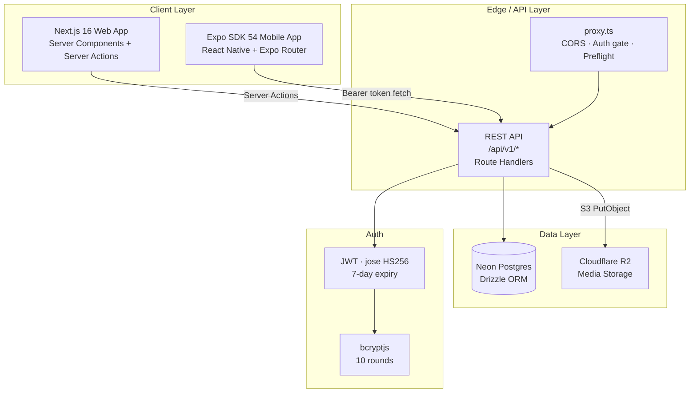
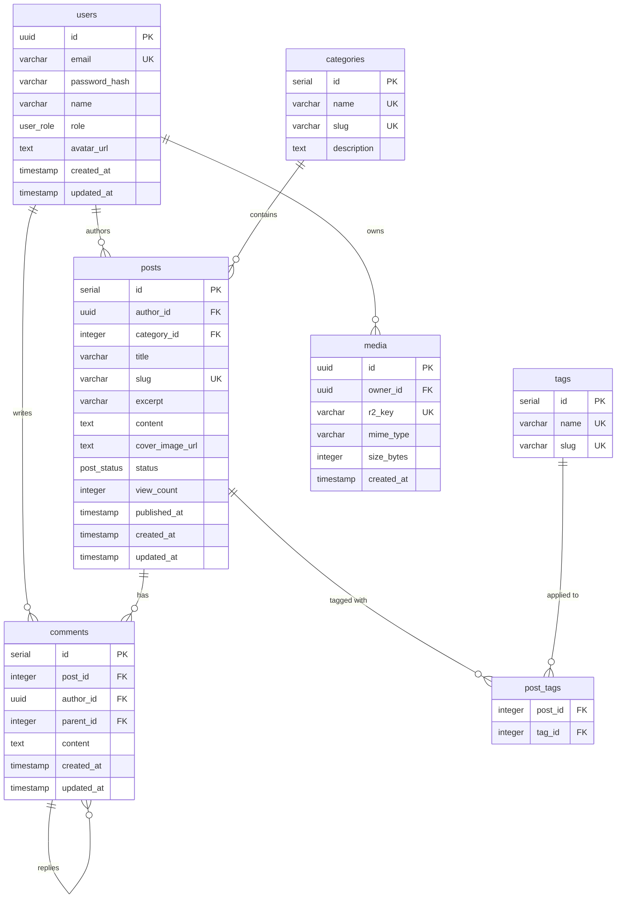

# Blog System — SoftUni Capstone Project

A full-stack, multi-platform blog system built as a SoftUni Capstone Project. The monorepo contains a **Next.js 16 web app**, an **Expo SDK 54 mobile app**, and a **shared TypeScript package**, all backed by Neon Postgres and Cloudflare R2.

## Live URLs

| App | URL |
|-----|-----|
| Web | https://full-stack-apps-blog-system.netlify.app |
| Mobile (Expo web export) | https://blog-system-mobile-app.netlify.app |

## Features

- JWT authentication (register, login, persistent sessions)
- Create, edit, publish, and delete blog posts with cover images
- Markdown content with live preview
- User avatars — upload from profile page, shown across feed, cards, comments, admin
- Category and tag organisation
- Comments on posts (with sign-in gate)
- Admin panel — manage all users, posts, and categories
- Full-text search across published posts
- Dashboard post filter — All / Published / Drafts
- Infinite-scroll feed with pull-to-refresh on mobile
- Server-side R2 uploads — files stream through `/api/v1/uploads/direct`, no browser CORS dance
- CORS-ready REST API consumed by both web and mobile
- Unit tests (Vitest) + GitHub Actions CI (lint · typecheck · test)

---

## Architecture



### Upload flow (web)

Direct browser → R2 uploads required exact CORS matching plus signed `Content-Length`, both of which the browser Fetch API restricts. The flow was simplified to route through the API:

```
Browser (FormData)
  → POST /api/v1/uploads/direct
  → route validates auth + size + mime
  → storage.service → S3Client.send(PutObjectCommand)
  → R2 stores object
  → API responds with public URL
  → client updates UI / persists URL via Server Action
```

### Request flow — mobile login

```
Phone (Expo Go)
  → fetch POST /api/v1/auth/login  (Bearer token in header)
  → proxy.ts attaches CORS headers
  → auth.service.ts: bcrypt.compare → signToken
  → 200 { user, token }
  → tokenStorage (Keychain on native, localStorage on web)
```

---

## Entity-Relationship Schema



---

## Tech Stack

| Layer | Technology |
|-------|-----------|
| Web frontend | Next.js 16, React 19, Tailwind CSS 4 |
| Mobile frontend | Expo SDK 54, React Native, Expo Router 4 |
| Shared types | TypeScript package (`@blog/shared`) |
| Database | Neon Postgres (serverless WebSocket driver) |
| ORM | Drizzle ORM + drizzle-kit |
| Auth | JWT (jose HS256), bcryptjs |
| Media storage | Cloudflare R2 (S3-compatible) |
| Package manager | pnpm 10 (hoisted node-linker) |
| Deployment | Netlify (web: `@netlify/plugin-nextjs`, mobile: static export) |

---

## Project Structure

```
blog-system/
├── apps/
│   ├── web/                  # Next.js 16 app
│   │   ├── src/
│   │   │   ├── app/          # App Router pages & API routes
│   │   │   │   ├── (site)/   # Public-facing pages
│   │   │   │   ├── api/v1/   # REST API route handlers (incl. uploads/direct)
│   │   │   │   └── actions/  # Server Actions (auth, posts, comments, profile)
│   │   │   ├── components/   # Shared React components
│   │   │   ├── lib/          # Client-safe utilities
│   │   │   ├── server/       # Server-only code
│   │   │   │   ├── db/       # Drizzle schema + client
│   │   │   │   ├── lib/      # JWT, R2, ServiceResult, slug
│   │   │   │   └── services/ # Business logic + storage
│   │   │   └── __tests__/    # Vitest unit tests
│   │   └── netlify.toml
│   └── mobile/               # Expo SDK 54 app
│       ├── app/              # Expo Router screens
│       ├── src/
│       │   ├── components/
│       │   ├── hooks/        # TanStack Query hooks
│       │   └── lib/          # api.ts, auth.ts, token-storage.ts
│       └── netlify.toml
└── packages/
    └── shared/               # @blog/shared — Zod schemas + TS types
```

---

## Local Development

### Prerequisites

- Node.js 20+
- pnpm 10+ (`npm i -g pnpm`)
- A [Neon](https://neon.tech) Postgres database
- A [Cloudflare R2](https://developers.cloudflare.com/r2/) bucket

### 1. Clone and install

```bash
git clone <repo-url>
cd blog-system
pnpm install
```

### 2. Environment variables

Create `apps/web/.env.local`:

```env
DATABASE_URL=postgresql://...           # Neon connection string
JWT_SECRET=<random-32+-char-string>

R2_ENDPOINT=https://<account-id>.r2.cloudflarestorage.com
R2_ACCESS_KEY_ID=<key>
R2_SECRET_ACCESS_KEY=<secret>
R2_BUCKET_NAME=<bucket>
R2_PUBLIC_BASE_URL=https://pub-<id>.r2.dev
```

Create `apps/mobile/.env.local`:

```env
# LAN IP of your dev machine so Expo Go on a physical device can reach the API
EXPO_PUBLIC_API_URL=http://192.168.x.x:3000
```

> On a physical device with Expo Go the Next.js dev server must listen on all
> interfaces. The `dev` script already includes `--hostname 0.0.0.0`.

### 3. Run database migrations

```bash
pnpm --filter web db:migrate
```

### 4. (Optional) Seed the database

```bash
pnpm --filter web db:seed
```

This creates 1 admin (`admin@blog.local` / `Admin123!`), 9 regular users
(`user1@blog.local` … `user9@blog.local` / `User123!`), categories, posts, and comments.

### 5. Start development servers

```bash
# Terminal 1 — Next.js (web + API)
pnpm dev:web

# Terminal 2 — Expo (mobile)
pnpm dev:mobile
```

- Web: http://localhost:3000
- Expo Metro bundler: http://localhost:8081 — scan the QR code with Expo Go

---

## Testing

Unit tests live in `apps/web/src/__tests__/` and cover the pure
utilities — `formatDate` / `formatNumber`, `ok` / `err` / `statusForError`,
slug generation, and JWT sign/verify round-trips.

```bash
pnpm --filter web test         # one shot
pnpm --filter web test:watch   # watch mode
```

`vitest.setup.ts` injects a test `JWT_SECRET` and `src/__mocks__/server-only.ts`
stubs `server-only` so server-side files import cleanly under Node.

## Continuous Integration

`.github/workflows/ci.yml` runs on every push and pull request to `main`:

1. `pnpm lint` (web + mobile)
2. `pnpm typecheck` (web + mobile + shared)
3. `pnpm --filter web test`

The CI job sets a dummy `JWT_SECRET` for the test run; no real secrets ever
touch the workflow.

---

## Deployment

### Web (Netlify)

Set the following environment variables in the Netlify site settings:

| Variable | Value |
|----------|-------|
| `DATABASE_URL` | Neon connection string |
| `JWT_SECRET` | Strong random secret |
| `R2_ENDPOINT` | `https://<account>.r2.cloudflarestorage.com` |
| `R2_ACCESS_KEY_ID` | R2 key |
| `R2_SECRET_ACCESS_KEY` | R2 secret |
| `R2_BUCKET_NAME` | Bucket name |
| `R2_PUBLIC_BASE_URL` | Public R2 URL |
| `MOBILE_ORIGIN` | `https://<mobile-netlify-site>.netlify.app` |

Build settings are in `apps/web/netlify.toml`.

### Mobile (Netlify)

Set one environment variable in the Netlify site settings:

| Variable | Value |
|----------|-------|
| `EXPO_PUBLIC_API_URL` | `https://<web-netlify-site>.netlify.app` |

`EXPO_PUBLIC_*` variables are baked into the JS bundle at build time — a
redeploy is required after changing them.

Build settings are in `apps/mobile/netlify.toml`.
